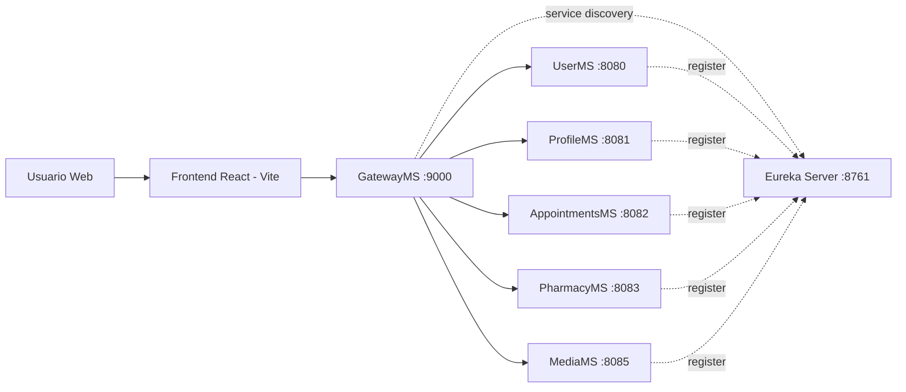

# HMS - Hospital Management System

Sistema de gestao hospitalar full stack com frontend em React + TypeScript e backend em arquitetura de microservicos com Spring Boot.

## Visao Geral

Este repositorio concentra dois blocos principais:

- Frontend web em React para os perfis de Admin, Medico e Paciente.
- Backend com servicos independentes para autenticacao, perfis, consultas, farmacia, midia, service discovery (Eureka) e API Gateway.

O fluxo principal de autenticacao usa JWT e o gateway faz validacao do token para proteger as rotas privadas.

## Arquitetura



## Stack Tecnologica

### Frontend
- React 19
- TypeScript
- Vite
- Mantine UI
- PrimeReact
- Redux Toolkit
- Axios

### Backend
- Spring Boot (multiplos servicos)
- Spring Cloud Gateway
- Netflix Eureka
- Spring Security
- Spring Data JPA
- OpenFeign
- MySQL
- JWT (io.jsonwebtoken)

## Estrutura do Projeto

```text
hmsReact/
|- hms/                      # Frontend React + TypeScript
|- backendHms/
|  |- eureka-server/         # Service discovery
|  |- GatewayMS/             # API Gateway
|  |- UserMS/                # Login, registro e emissao de JWT
|  |- ProfileMS/             # Perfil de medico e paciente
|  |- AppointmentsMS/        # Consultas e prontuarios
|  |- PharmacyMS/            # Medicamentos, estoque e vendas
|  |- media/                 # Upload e leitura de arquivos de midia
|  |- DB_Diagrams/           # Diagramas de banco
|- README.md
```

## Principais Modulos de Dominio

### UserMS
- Base path: /user
- Endpoints principais:
	- POST /user/register
	- POST /user/login

### ProfileMS
- Base paths: /profile/doctor e /profile/patient
- Operacoes: criar, buscar, atualizar, validacoes e dropdowns para selecao de medicos.

### AppointmentsMS
- Base paths: /appointment e /appointment/report
- Operacoes: agendar, cancelar, listar por paciente/medico, criar e consultar relatorios/prescricoes.

### PharmacyMS
- Base paths:
	- /pharmacy/medicine
	- /pharmacy/inventory
	- /pharmacy/sales
	- /pharmacy/saleItem
- Operacoes: catalogo de medicamentos, controle de estoque, vendas e itens de venda.

### MediaMS
- Base path: /media
- Operacoes: salvar e recuperar arquivos.

## Frontend: Rotas e Perfis

Rotas principais implementadas no app:

- Publicas: /login, /register
- Admin: /admin/*
- Medico: /doctor/*
- Paciente: /patient/*

A navegacao de rotas privadas depende de token JWT armazenado no localStorage.

## Seguranca

- JWT gerado no UserMS.
- Gateway valida o token (exceto /user/login e /user/register).
- Gateway injeta header interno X-Secret-Key: SECRET para comunicacao entre servicos.
- Servicos internos aceitam chamadas apenas com este header interno.

## Pre-requisitos

- Node.js 20+
- npm 10+
- Java JDK 21 (recomendado para o conjunto do monorepo)
- Maven Wrapper (ja incluso em cada microservico)
- MySQL 8+

## Configuracao de Ambiente

Cada microservico usa application.properties com import opcional de .env. Para ambiente local, recomenda-se criar arquivos .env por servico com variaveis sensiveis.

Variavel critica para autenticacao JWT (necessaria em UserMS e GatewayMS):

```env
jwt.key=SUA_CHAVE_SECRETA_FORTE_AQUI
```

Observacao importante:
- Nao versione senhas/chaves reais no repositorio.
- Use valores locais via .env e secrets no ambiente de deploy.

## Banco de Dados

Os servicos usam bancos MySQL separados:

- userdb
- profiledb
- appointmentsdb
- pharmacydb
- mediadb

Os diagramas estao em:
- backendHms/DB_Diagrams/user_ms_db_diagram.pdf
- backendHms/DB_Diagrams/profile_ms_db_diagram.pdf
- backendHms/DB_Diagrams/appointment_ms_db_diagram.pdf
- backendHms/DB_Diagrams/micro_diagram_v1.pdf

## Como Rodar Localmente

### 1. Subir backend (ordem recomendada)

Abra um terminal para cada servico.

1) Eureka Server

```powershell
cd backendHms/eureka-server/eureka-server
./mvnw.cmd spring-boot:run
```

2) Gateway

```powershell
cd backendHms/GatewayMS/GatewayMS
./mvnw.cmd spring-boot:run
```

3) Demais microservicos

```powershell
cd backendHms/UserMS/UserMS
./mvnw.cmd spring-boot:run

cd backendHms/ProfileMS/ProfileMS
./mvnw.cmd spring-boot:run

cd backendHms/AppointmentsMS/AppointmentsMS
./mvnw.cmd spring-boot:run

cd backendHms/PharmacyMS/PharmacyMS
./mvnw.cmd spring-boot:run

cd backendHms/media/media
./mvnw.cmd spring-boot:run
```

### 2. Subir frontend

```powershell
cd hms
npm install
npm run dev
```

Aplicacao frontend: http://localhost:5173

## Portas Padrao

- Eureka Server: 8761
- GatewayMS: 9000
- UserMS: 8080
- ProfileMS: 8081
- AppointmentsMS: 8082
- PharmacyMS: 8083
- MediaMS: 8085

## Endpoints de Referencia (via Gateway)

- Auth: /user/*
- Perfis: /profile/*
- Consultas: /appointment/*
- Farmacia: /pharmacy/*
- Midia: /media/*

Base URL local: http://localhost:9000

## Qualidade e Melhorias Futuras

- Adicionar testes integrados end-to-end para fluxos criticos.
- Padronizar versoes Java/Spring Boot entre microservicos.
- Introduzir conteinerizacao com Docker Compose.
- Configurar pipeline CI/CD com checks automatizados.
- Documentar API com OpenAPI/Swagger por servico.

## Contribuicao

Contribuicoes sao bem-vindas.

Fluxo recomendado:

1. Crie uma branch para sua feature.
2. Implemente e valide localmente.
3. Abra um Pull Request com descricao objetiva.

## Licenca
Projeto ainda em fase de testes com fins educacionais
