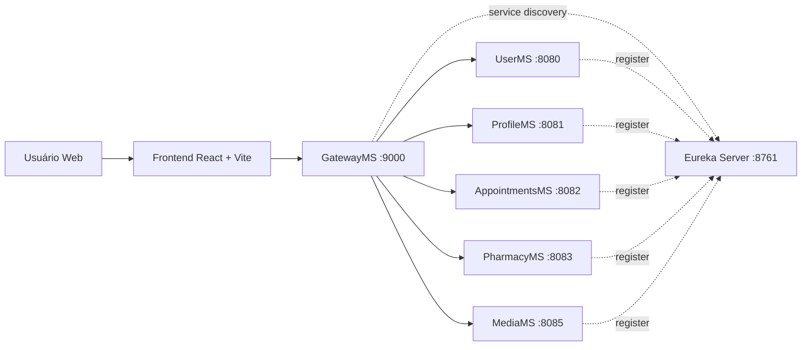

# HMS - Hospital Management System

O HMS é uma plataforma full stack para apoiar a operação hospitalar com uma experiência única para três perfis centrais: administração, corpo clínico e pacientes. Em vez de espalhar processos entre planilhas, sistemas isolados e cadastros duplicados, o projeto concentra autenticação, perfis, consultas, farmácia e mídia em uma arquitetura integrada.

## O problema que o produto resolve

Hospitais e clínicas lidam com rotinas que dependem de informação confiável e disponível em tempo real. Quando cadastro, agenda clínica, prontuário, estoque e vendas de farmácia ficam desconectados, a operação perde velocidade, aumenta o retrabalho e reduz a visibilidade sobre o atendimento.

O HMS foi estruturado para resolver esse cenário com uma base única de acesso e múltiplos domínios especializados:

- Administração com visão operacional de médicos, pacientes, medicamentos, estoque e vendas.
- Médicos com acesso ao próprio perfil, à agenda de consultas e aos detalhes do atendimento.
- Pacientes com acesso ao próprio perfil e ao acompanhamento dos agendamentos.
- Back-end dividido por contexto de negócio, facilitando evolução, manutenção e escalabilidade.

## Visão do produto

No estágio atual do repositório, a solução cobre os seguintes fluxos principais:

- Login e registro com autenticação baseada em JWT.
- Gestão de perfis de médicos e pacientes.
- Agendamento e acompanhamento de consultas.
- Registro de relatórios e prescrições clínicas.
- Gestão farmacêutica com catálogo de medicamentos, controle de estoque e vendas.
- Upload e recuperação de arquivos de mídia.

## Arquitetura em alto nível

O projeto adota uma arquitetura de microserviços com gateway central, descoberta de serviços via Eureka e um frontend React consumindo a API unificada.



### Como essa arquitetura se organiza

- O frontend concentra a experiência do usuário e consome uma única base URL local: `http://localhost:9000`.
- O `GatewayMS` recebe as requisições externas, valida o JWT e encaminha cada rota para o microserviço correto.
- O `Eureka Server` remove o acoplamento por endereço fixo entre os serviços.
- Cada domínio possui seu próprio serviço e seu próprio banco MySQL, reduzindo dependências cruzadas.
- A comunicação interna entre serviços utiliza o cabeçalho `X-Secret-Key` para chamadas protegidas.

## Módulos de negócio

| Módulo | Responsabilidade principal |
| --- | --- |
| `UserMS` | Registro, login e emissão de JWT. |
| `ProfileMS` | Gestão de perfis de médicos e pacientes. |
| `AppointmentsMS` | Consultas, prontuários e prescrições. |
| `PharmacyMS` | Medicamentos, estoque, vendas e itens de venda. |
| `MediaMS` | Upload e recuperação de arquivos. |
| `GatewayMS` | Roteamento, validação de token e entrada única da API. |
| `eureka-server` | Descoberta e registro de serviços. |

## Stack tecnológica

### Frontend

- React 19
- TypeScript
- Vite
- React Router
- Redux Toolkit
- Axios com interceptor para injeção automática do token
- Mantine UI
- PrimeReact
- Tailwind CSS 4

### Backend

- Java 17
- Spring Boot
- Spring Cloud Gateway
- Netflix Eureka
- Spring Security
- Spring Data JPA
- OpenFeign
- MySQL
- JWT com `io.jsonwebtoken`

## Pontos técnicos importantes

### Frontend

- As rotas são separadas por perfil de uso: `admin`, `doctor` e `patient`.
- O controle de sessão usa `localStorage`, `Redux Toolkit` e rotas protegidas.
- A camada de consumo da API fica desacoplada em `services/`, com autenticação centralizada em `interceptor/AxiosInterceptor.tsx`.
- A organização do frontend segue uma divisão clara entre `Layout`, `pages`, `components`, `services`, `slices` e `utilities`.

### Backend

- O gateway concentra autenticação e roteamento, evitando replicar essa responsabilidade em todos os serviços expostos externamente.
- Os serviços se registram no Eureka e podem ser resolvidos por nome, o que melhora a flexibilidade da malha interna.
- Cada microserviço mantém seu próprio contexto de dados, alinhado ao domínio que representa.
- O repositório já inclui diagramas de banco para apoiar entendimento e evolução da modelagem.

## Estrutura do repositório

```text
hmsReact/
|- hms/                      # Frontend React + TypeScript
|- backendHms/
|  |- eureka-server/         # Descoberta de serviços
|  |- GatewayMS/             # API Gateway
|  |- UserMS/                # Autenticação e usuários
|  |- ProfileMS/             # Perfis de médicos e pacientes
|  |- AppointmentsMS/        # Consultas, prontuários e prescrições
|  |- PharmacyMS/            # Farmácia, estoque e vendas
|  |- media/                 # Arquivos e mídia
|  |- DB_Diagrams/           # Diagramas de banco de dados
|- README.md
```

## Rotas e perfis no frontend

As rotas principais atualmente implementadas no aplicativo são:

- Públicas: `/login` e `/register`
- Administração: `/admin/*`
- Médico: `/doctor/*`
- Paciente: `/patient/*`

## Segurança

- O JWT é emitido no `UserMS`.
- O `GatewayMS` valida o token antes de encaminhar a requisição.
- As rotas públicas de autenticação ficam liberadas para login e registro.
- As chamadas internas entre serviços usam o cabeçalho `X-Secret-Key`.

## Bancos de dados por domínio

Os serviços estão organizados com bancos MySQL separados:

- `userdb`
- `profiledb`
- `appointmentsdb`
- `pharmacydb`
- `mediadb`

Diagramas disponíveis no repositório:

- `backendHms/DB_Diagrams/user_ms_db_diagram.pdf`
- `backendHms/DB_Diagrams/profile_ms_db_diagram.pdf`
- `backendHms/DB_Diagrams/appointment_ms_db_diagram.pdf`
- `backendHms/DB_Diagrams/micro_diagram_v1.pdf`

## Pré-requisitos

- Node.js 20+
- npm 10+
- Java JDK 17
- MySQL 8+
- Maven Wrapper, já incluído em cada microserviço

## Configuração de ambiente

Os microserviços já suportam importação opcional de variáveis a partir de arquivos `.env`. Para ambiente local, o ideal é manter segredos e credenciais fora do versionamento.

Exemplo de variável crítica para autenticação JWT:

```env
jwt.key=SUA_CHAVE_SECRETA_FORTE_AQUI
```

Recomendações:

- Não versione senhas e chaves reais.
- Prefira arquivos `.env` locais e segredos configurados no ambiente de execução.

## Como rodar localmente

### 1. Subir o back-end

Abra um terminal para cada serviço e siga a ordem abaixo.

1. `eureka-server`

```powershell
cd backendHms/eureka-server/eureka-server
./mvnw.cmd spring-boot:run
```

2. `GatewayMS`

```powershell
cd backendHms/GatewayMS/GatewayMS
./mvnw.cmd spring-boot:run
```

3. Demais microserviços

```powershell
cd backendHms/UserMS/UserMS
./mvnw.cmd spring-boot:run

cd backendHms/ProfileMS/ProfileMS
./mvnw.cmd spring-boot:run

cd backendHms/AppointmentsMS/AppointmentsMS
./mvnw.cmd spring-boot:run

cd backendHms/PharmacyMS/PharmacyMS
./mvnw.cmd spring-boot:run

cd backendHms/media/media
./mvnw.cmd spring-boot:run
```

### 2. Subir o frontend

```powershell
cd hms
npm install
npm run dev
```

Aplicação local do frontend: `http://localhost:5173`

## Portas padrão

- `eureka-server`: `8761`
- `GatewayMS`: `9000`
- `UserMS`: `8080`
- `ProfileMS`: `8081`
- `AppointmentsMS`: `8082`
- `PharmacyMS`: `8083`
- `MediaMS`: `8085`

## Endpoints de referência via gateway

- Autenticação: `/user/*`
- Perfis: `/profile/*`
- Consultas: `/appointment/*`
- Farmácia: `/pharmacy/*`
- Mídia: `/media/*`

Base URL local: `http://localhost:9000`

## Estado atual e evolução

O projeto já demonstra uma base consistente para um sistema hospitalar modular, com separação por domínio e autenticação centralizada. Como próximos passos naturais de produto e engenharia, vale considerar:

- Ampliação dos fluxos administrativos e clínicos ainda em evolução no frontend.
- Testes integrados para jornadas críticas.
- Conteinerização com Docker Compose.
- Pipeline de CI/CD com verificações automáticas.
- Documentação de API com OpenAPI ou Swagger por serviço.

## Contribuição

Contribuições são bem-vindas.

Fluxo recomendado:

1. Crie uma branch para sua feature.
2. Implemente e valide localmente.
3. Abra um Pull Request com uma descrição objetiva.

## Licença

Projeto em evolução, atualmente utilizado com fins acadêmicos e de experimentação.
